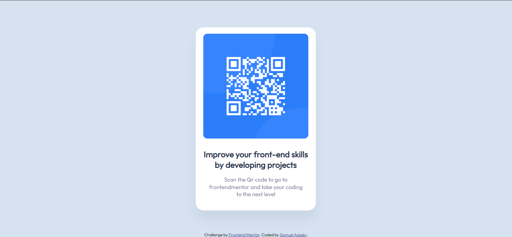
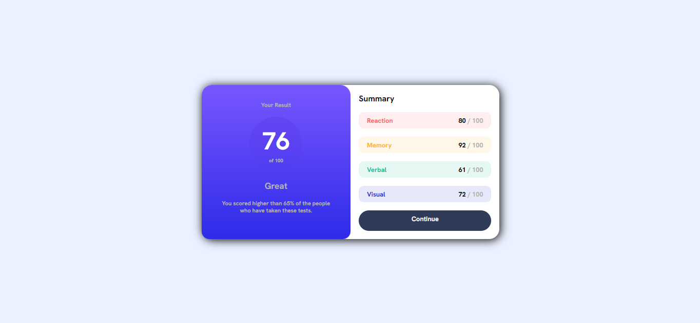
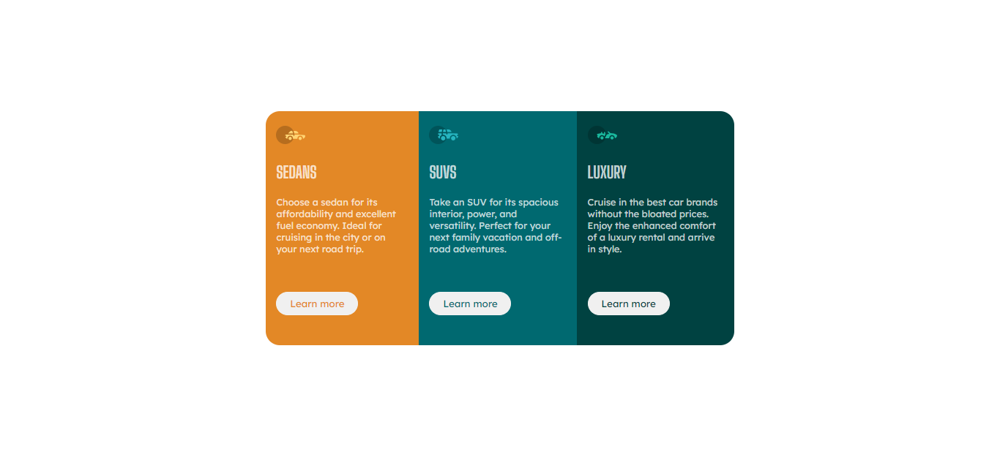
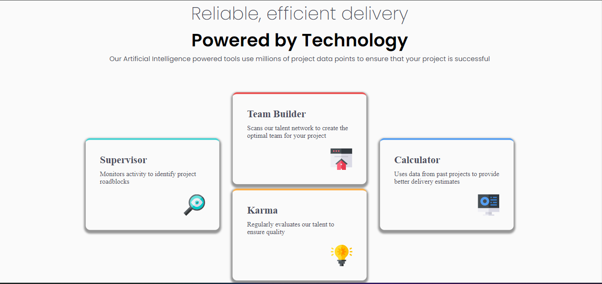

# This repository contains some of the tasks I have completed on Frontendmentor.io platform

#[Frontend mentor](https://nanayaww.github.io/FrontendMentor-Challenges/)

## Table of Contents
 - [Table of Contents](#table-of-contents)
 - [blog-preview-card-main](#blog-preview-card-main)
 - [qr-code-component](#qr-code-component)

## blog-preview-card-main

- Live Site URL: [Live View](https://nanayaww.github.io/FrontendMentor-Challenges/blog-preview-card-main)

## qr-code-component

- Live Site URL: [Live View](https://nanayaww.github.io/FrontendMentor-Challenges/qr-code-component)

#results-summary-component-main

Live Site URL: [Live View](https://nanayaww.github.io/FrontendMentor-Challenges/results-summary-component-main)

#3-column-preview-card-component-main

Live Site URL: [Live View](https://nanayaww.github.io/FrontendMentor-Challenges/3-column-preview-card-component-main)

#four-card-feature-section-master

Live Site URL : [Live View](https://nanayaww.github.io/FrontendMentor-Challenges/four-card-feature-section-master)