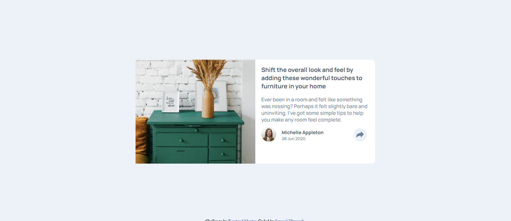

# Frontend Mentor - Article preview component solution

This is a solution to the [Article preview component challenge on Frontend Mentor](https://www.frontendmentor.io/challenges/article-preview-component-dYBN_pYFT). Frontend Mentor challenges help you improve your coding skills by building realistic projects. 

## Table of contents

- [Overview](#overview)
  - [The challenge](#the-challenge)
  - [Screenshot](#screenshot)
  - [Links](#links)
- [My process](#my-process)
  - [Built with](#built-with)
  - [What I learned](#what-i-learned)
  - [Continued development](#continued-development)
- [Author](#author)

**Note: Delete this note and update the table of contents based on what sections you keep.**

## Overview

### The challenge

Users should be able to:

- View the optimal layout for the component depending on their device's screen size
- See the social media share links when they click the share icon

### Screenshot



### Links

- Solution URL: [Solution](https://github.com/nanayaww/FrontendMentor-Challenges/tree/main/article-preview-component-main)
- Live Site URL: [Live Site](https://nanayaww.github.io/FrontendMentor-Challenges/article-preview-component-main)

## My process

### Built with

- Semantic HTML5 markup
- CSS custom properties
- Flexbox
- CSS Grid
- Mobile-first workflow


### What I learned

- Durung this challenge, I was able to recap my knowledge of CSS flexbos and Grids;
- I also learnt about how to use `window.mediaMatch()` in JavaScript

```js
if (window.matchMedia("(max-width: 450px)").matches) {
            showSocials();

    } else {
        showSocialsBig()
    }
```

### Continued development

- Going I want to improve my knowledge on how to make my website more responsive

## Author

- Github - [Samuel Nkrumah](https://github.com/nanayaww)
- Frontend Mentor - [@criptyn](https://www.frontendmentor.io/profile/criptyn)

