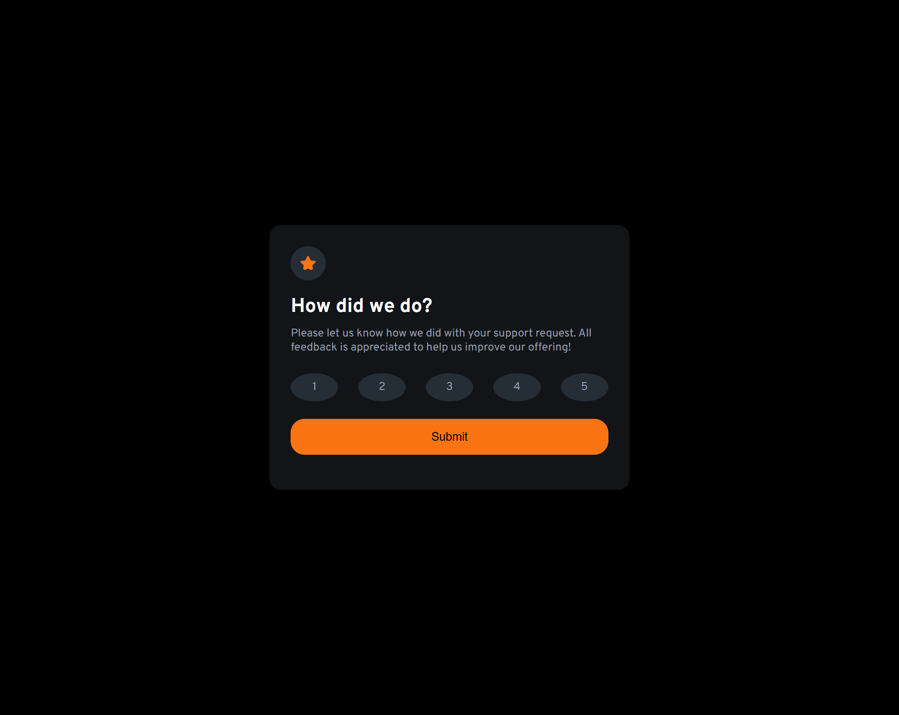

# Frontend Mentor - Interactive rating component solution

This is a solution to the [Interactive rating component challenge on Frontend Mentor](https://www.frontendmentor.io/challenges/interactive-rating-component-koxpeBUmI). Frontend Mentor challenges help you improve your coding skills by building realistic projects. 

## Table of contents

- [Overview](#overview)
  - [The challenge](#the-challenge)
  - [Screenshot](#screenshot)
  - [Links](#links)
- [My process](#my-process)
  - [Built with](#built-with)
  - [What I learned](#what-i-learned)
  - [Continued development](#continued-development)
  - [Useful resources](#useful-resources)
- [Author](#author)


## Overview

### The challenge

Users should be able to:

- View the optimal layout for the app depending on their device's screen size
- See hover states for all interactive elements on the page
- Select and submit a number rating
- See the "Thank you" card state after submitting a rating

### Screenshot




### Links

- Solution URL: [Solution](https://github.com/nanayaww/FrontendMentor-Challenges/tree/main/interactive-rating-component)
- Live Site URL: [Live Site](https://nanayaww.github.io/FrontendMentor-Challenges/interactive-rating-component)

## My process

### Built with

- Semantic HTML5 markup
- CSS custom properties
- Flexbox
- CSS Grid
- Mobile-first workflow

### What I learned

-During this project I improved my knowledge on how to build a responsive website. I however found difficulties in writing out good media queries to make my solution more responsive to larger screens.


```js
scoreNumber.forEach((element) => {
  const selectedScore = element.innerText;

  element.addEventListener("click", () => {
    scoreNumber.forEach((li) => li.classList.remove("active"));

    element.classList.add("active");

    score = selectedScore;
  });
});
```

### Continued development

-Going forward, I will look to improve my knowledge on media queries in CSS.

## Author

- Github - [Samuel Nkrumah](https://github.com/nanayaww)
- Frontend Mentor - [@criptyn](https://www.frontendmentor.io/profile/criptyn)
